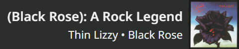
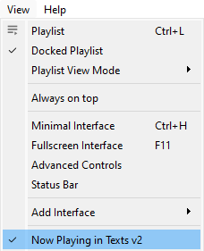

<!-- SHIELDS -->
[![Stargazers][stars-shield]][stars-url]
[![Forks][forks-shield]][forks-url]
[![Issues][issues-shield]][issues-url]
[![MIT License][license-shield]][license-url]


# VLC Now-Playing Overlay

<!-- TABLE OF CONTENTS -->
<details>
<summary>Table of Contents</summary>

<ol>
	<li>
		<a href="#about">About</a>
	</li>
	<li>
		<a href="#getting-started">Getting Started</a>
		<ul>
			<li><a href="#prerequisites">Prerequisites</a></li>
			<li><a href="#installation">Installation</a></li>
			<li><a href="#configuration-reference">Configuration Reference</a></li>
		</ul>
	</li>
	<li>
		<a href="#usage">Usage</a>
	</li>
	<li><a href="#contributing">Contributing</a></li>
	<li><a href="#license">License</a></li>
</ol>
</details>


<!-- ABOUT -->
## About

This project allows you to have a nice web-based display for your current track played in VLC. You can then add it to your stream scene with a browser capture.

Example:  


With a long title:  



<!-- GETTING STARTED -->
## Getting Started

### Prerequisites

* [VLC Media Player](https://www.videolan.org/vlc/)
* The [Now Playing in Texts](https://addons.videolan.org/p/1172613/) VLC plugin
* [Node.js](https://nodejs.org/en/download/)

### Installation

1. Clone the repository:  
	* With HTTPS:
		```sh
		git clone https://github.com/r-o-b-o-t-o/vlc-now-playing-overlay.git
		```
		**OR**
	* With SSH:
		```sh
		git clone git@github.com:r-o-b-o-t-o/vlc-now-playing-overlay.git
		```
2. Install the dependencies:
	```sh
	cd vlc-now-playing-overlay/
	npm install
	```
3. Configure the application: copy `config.default.json` to `config.json` and edit the resulting file.  
	See the [Configuration Reference](#configuration-reference) below for a description of all values.

### Configuration Reference

<details>
	<summary>config.json</summary>

| Field        | Type   | Default value      | Description                                                                                                                                                                            |
|--------------|--------|--------------------|----------------------------------------------------------------------------------------------------------------------------------------------------------------------------------------|
| `vlcDataDir` | String | `"%APPDATA%\\vlc"` | The directory that contains the "now playing" text files created by the VLC plugin. See the [plugin's page](https://addons.videolan.org/p/1172613/) to find the directory for your OS. |
| `port`       | Number | `34766`            | The HTTP port to listen on.                                                                                                                                                            |
</details>

<p align="right">(<a href="#top">back to top</a>)</p>


<!-- USAGE -->
## Usage

1. Open VLC Media Player

2. Enable the VLC plugin **(needs to be done manually each time you start VLC!)**:  


3. Start the application:
	```sh
	cd vlc-now-playing-overlay/
	npm start
	```

4. Play some music!

5. Make sure the server is working: open a web browser and navigate to http://localhost:34766 (change the port in accordance with your configuration file)

6. Add a browser source to your scene:
	* Use the same URL as step 5, e.g. `http://localhost:34766`
	* The widget's size is 480x100 pixels
  
	


Other useful npm scripts:
* `npm run watch`: watches for changes and restarts automatically, useful for development

<p align="right">(<a href="#top">back to top</a>)</p>


<!-- CONTRIBUTING -->
## Contributing

Any and all contributions are **greatly appreciated**.

If you have a suggestion that would make this project better, feel free to fork the repository and create a Pull Request. You can also open an [issue][issue].

<p align="right">(<a href="#top">back to top</a>)</p>


<!-- SUPPORT -->
## Show your Support

⭐️ Give the project a star if you like it!

<a href="https://ko-fi.com/roboto" target="_blank">

<p align="right">(<a href="#top">back to top</a>)</p>


<!-- LICENSE -->
## License

Distributed under the MIT License. See the [`LICENSE`][license-url] file for more information.

<p align="right">(<a href="#top">back to top</a>)</p>


<!-- CONTACT -->
## Contact

 Feel free to get in touch with me on Discord: `roboto_`

<p align="right">(<a href="#top">back to top</a>)</p>


<!-- MARKDOWN LINKS -->
<!-- https://www.markdownguide.org/basic-syntax/#reference-style-links -->
[github-ac]: https://github.com/azerothcore/azerothcore-wotlk
[stars-shield]: https://img.shields.io/github/stars/r-o-b-o-t-o/vlc-now-playing-overlay.svg?style=flat
[stars-url]: https://github.com/r-o-b-o-t-o/vlc-now-playing-overlay/stargazers
[forks-shield]: https://img.shields.io/github/forks/r-o-b-o-t-o/vlc-now-playing-overlay.svg?style=flat
[forks-url]: https://github.com/r-o-b-o-t-o/vlc-now-playing-overlay/network/members
[issues-shield]: https://img.shields.io/github/issues/r-o-b-o-t-o/vlc-now-playing-overlay.svg?style=flat
[issues-url]: https://github.com/r-o-b-o-t-o/vlc-now-playing-overlay/issues
[license-shield]: https://img.shields.io/github/license/r-o-b-o-t-o/vlc-now-playing-overlay.svg?style=flat
[license-url]: https://github.com/r-o-b-o-t-o/vlc-now-playing-overlay/blob/master/LICENSE
[issue]: https://github.com/r-o-b-o-t-o/vlc-now-playing-overlay/issues/new
